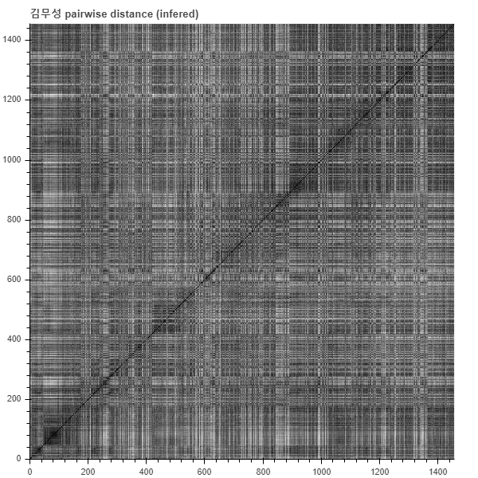
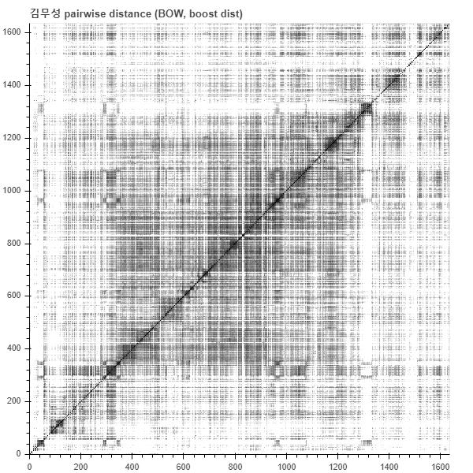
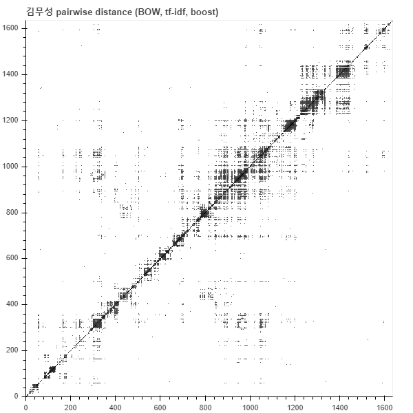
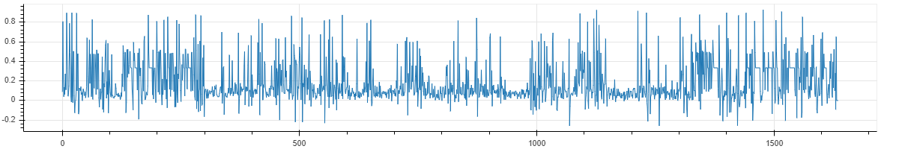

## Sequence segmentation and labeling for summarizing document stream

특정 인물에 대한 뉴스 기사를 시간대 별로 요약한다. 이를 위해서는 (1) 사건을 탐지하고, (2) 사건을 요약해야 한다.

Topic detection and tracking (TDT) 은 이와 같은 문제를 해결하기 위한 방법이다. 이 방법은 `급상승 키워드` 를 탐색하는 방법으로 자주 이용되었다. 이 방법은 비교군으로 추가 실험을 할 예정이다. 하지만 TDT 는 각 단어 기준으로 bursty topic (term) 을 탐색한다.

우리의 목적은 급상승 키워드나 emerging topic 을 탐색하는 것이 아니라, 문서 집합을 요약하는 것이다.

예를 들어 정치인 `김무성`에 관련된 뉴스를 시간대 별로 요약하려 한다. 문서의 요약을 위해서 abstractive methods 나 extractive methods 가 이용될 수 있는데, 여기서는 extractive methods 를 이용한다.

Document stream 을 요약하기 위해서는 우선 같은 사건에 대한 문서 집합을 찾아야 하며, 이는 stream segmentation 이 포함된다. Bursty term detection 도 이를 위해 이용될 수 있지만, document sequence segmentation 을 이용한다.

작업 순서는 아래와 같다.

`김무성` 이 포함된 뉴스 기사를 수집하여 각 날짜별로 하나의 문서집합을 만든다. 여기에는 정치와 관련없는 문서들도 포함될 수 있지만, 이러한 문서를 정제하는 필터링 과정은 다루지 않는다.

날짜 별로 문서를 벡터 di 로 표현하면 document sequence 는 [d1, d2, ..., dn] 으로 표현할 수 있는데, 이를 pairwise distance 로 표현하면 같은 주제의 문서들이 생성될 때 segment = [dk, d_{k+1}, ... d_{k+p}] 는 서로 비슷한 문서이다.

문서를 벡터로 표현하는 방법은 다양하며, Doc2Vec 과 같은 distributed representation 이나 Bag-of-words 같은 sparse representation 을 이용할 수도 있다.

아래는 Word2Vec 을 이용하여 학습된 word vectors 을 이용하여 각 날짜별 di 의 distributed representation 을 inference 한 예시이다. 문서들이 조금씩 구분되기는 하지만, 패턴이 뚜렷하지 않다.

```python
import pickle
from politicianmap.utils import draw_pairwise_distance
from sklearn.metrics import pairwise_distances

# infered docvec
with open('/workspace/lovit/politicianmap/docvec_infered/each_0_docvec.pkl', 'rb') as f:
    docvec = pickle.load(f)
with open('/workspace/lovit/politicianmap/docvec_infered/date_0.txt', encoding='utf-8') as f:
    idx_to_date = [doc.strip() for doc in f]

print(docvec.shape)
print(len(idx_to_date))

pdist = pairwise_distances(docvec, metric='cosine')
p = draw_pairwise_distance(pdist, title='김무성 pairwise distance (infered)')
show(p)
```



오히려 bag of words model 이 더 명료한 표현을 보여준다. BOW 는 cosine distance 가 0.5 보다 크면 조금씩 다른 내용의 문서라는 어떤 사전지식이 있다. 이를 이용하여 distance scaling 도 함께 수행한다. Doc2vec 보다는 더 좋은 모습이지만, 여전히 패턴이 뚜렷하지 않다.

```python
# sparse docvec
from scipy.io import mmread

# docvec = mmread('/workspace/lovit/politicianmap/bow/each_bow_0.mtx').tocsr()
with open('/workspace/lovit/politicianmap/bow/each_date_0.txt', encoding='utf-8') as f:
    idx_to_date = [doc.strip() for doc in f]
with open('/workspace/lovit/politicianmap/bow/each_vocab_0.txt', encoding='utf-8') as f:
    idx_to_vocab = [vocab.strip() for vocab in f]

print(docvec.shape) # (1636, 69597)
print(len(idx_to_date)) # 1636

pdist = pairwise_distances(docvec, metric='cosine')
pdist = 2 * pdist
pdist[np.where(pdist > 1)] = 1
pdist = np.exp(pdist - 0.5) # cosine dist 0.25 부터 boost up
p = draw_pairwise_distance(pdist, title='김무성 pairwise distance (BOW, boost dist)')
show(p)
```



Stopword filtering 이 되어있지 않으니 tf-idf transform 을 이용하여 빈번한 단어의 영향력을 줄였더니 시간대 별로 어떤 뭉치들이 있음을 확인할 수 있다.

```python
from sklearn.feature_extraction.text import TfidfTransformer

docvec_tfidf = TfidfTransformer().fit_transform(docvec)
pdist = pairwise_distances(docvec_tfidf, metric='cosine')
pdist[np.where(pdist > 0.5)] = 1
t = 0.3
pdist = (np.exp(pdist - t) - np.exp(-t)) / (np.exp(1-t) - np.exp(-t)) # cosine dist 0.25 부터 boost up
p = draw_pairwise_distance(pdist, title='김무성 pairwise distance (BOW, tf-idf, boost)')
show(p)
```



위 그림에서 대각선에 위치한 검은색 정사각형을 segment 로 추출해야 한다. 이를 위한 한 가지 방법으로 (p, q) 가 segment index 이고 q 가 segment boundary 라 할 때, pairwise distance (p ~ q, p ~ q) 와 (p ~ q, q+1) 의 차이가 급격히 커짐을 이용하였다.

예를 들어 위의 그림에서 index 1510 부터 1518 까지는 거의 비슷한 벡터인데, 1519 부터 다른 document representation 을 지닌다.

```python
from politicianmap.segmentation import point_shift_distance

print(point_shift_distance(pdist, 1510, 1513)) # 0.038890998413362646
print(point_shift_distance(pdist, 1510, 1514)) # 0.12237766280682266
print(point_shift_distance(pdist, 1510, 1515)) # 0.10597456466866798
print(point_shift_distance(pdist, 1510, 1516)) # 0.07460440733975646
print(point_shift_distance(pdist, 1510, 1517)) # 0.15852535857605984
print(point_shift_distance(pdist, 1510, 1518)) # -0.03562157712006217
print(point_shift_distance(pdist, 1510, 1519)) # 0.7833967209213221
print(point_shift_distance(pdist, 1510, 1520)) # 0.5805452845955645
```

앞의 3 칸을 base 로, 다음 1 칸을 segment boundary 밖의 점으로 가정할 때의 거리값이다.

```python
from politicianmap.segmentation import shift_distance

dist = shift_distance(pdist)
```



이를 이용하여 정사각형을 추출한다. 

```python
from politicianmap.segmentation import find_rectangular

segments = find_rectangular(pdist, threshold=0.5, min_length=5)
len(segments) # 74
```

segments 에는 (1511, 1519) 가 포함되어 있다. 1519 는 포함되지 않는 index 이다. 이들에 해당하는 날짜는 아래처럼 확인할 수 있다.

```python
idx_to_date[1511], idx_to_date[1519] # ('2018-06-15', '2018-06-23')
```

이 날짜의 뉴스를 가져와 키워드를 추출한다. 키워드는 soykeywords 에서 이용하는 방법이다. 해당 segment 의 단어 분포를 pos prop 라 할 때, margin 만큼 떨어진 앞, 뒤의 문서들의 단어 분포를 rep prop 로 가져온다. 예를 들어 margin 이 3 이고, ref_size = 2 라면 2018-06-15 의 (3 + 8 * 2 일전, 3 일전) 문서와 (2018-06-23 의 (3 일후, 3 + 8 * 2 일후)의 문서를 reference documents 로 지정하고, 이 날의 단어 분포를 rep prop 로 정의한다.

그리고 pos prop / (pos prop + ref prop) 로 키워드 점수를 정의한다. pos prop 에서 top1 개의 최빈 단어를 단어 후보로 선택한 뒤, 키워드 점수가 높은 top2 (top2 < top1) 개의 단어를 선택한다.

```python
from politicianmap.summarization import extract_keywords

doc_idx = [i for i in range(1511, 1519+1)]
keywords = extract_keywords(docvec, doc_idx, idx_to_vocab, margin=3, ref_size=2)
```

(키워드, 키워드 점수, pos prop) 형식으로 출력된다.

```
[('권한대행', 0.9864330804617604, 0.004095674079692283),
 ('해체', 0.9520378204736433, 0.001982826340168486),
 ('의총', 0.9493476054481224, 0.0017173659831513936),
 ('참패', 0.9423955001123874, 0.00238372565484736),
 ('초선', 0.9127756985421187, 0.0015169163258119565),
 ('혁신', 0.9025322752754071, 0.0020099141317008423),
 ('그래', 0.8895858433732569, 0.0020695072730720263),
 ('의원총회', 0.867319991505561, 0.0017282010997643363),
 ('불출마', 0.8410270492560441, 0.0026383508952515103),
 ('구성', 0.8345445892898834, 0.0015494216756507843),
 ('지방선거', 0.8339731215326067, 0.0029200639271880166),
 ('새로운', 0.8288173428101958, 0.0015927621421025543),
 ('김성태', 0.8105700398071106, 0.004361134436709375),
 ('쇄신', 0.803102762021896, 0.0016144323753284394),
 ('당을', 0.7791959335270798, 0.001722783541457865),
 ('책임', 0.7779959156390338, 0.0030663380014627406),
 ('선언', 0.7701773158833669, 0.0023458027467020614),
 ('인터뷰', 0.7568298575723069, 0.0025245821708156134),
 ('갈등', 0.7470891653017597, 0.001863640057426118),
 ('총선', 0.7408241718748506, 0.0034564021995286726),
 ('탈당', 0.7400621482234484, 0.0017769591245225776),
 ('보수', 0.7235306619645111, 0.00391147709727226),
 ('정당', 0.7060355527683297, 0.0016577728417802096),
 ('비대위', 0.7009656696140699, 0.0017552888912966925),
 ('계파', 0.689028623324735, 0.0019936614567814285),
 ('국민들', 0.6848367951779588, 0.0022211989056532223),
 ('친박', 0.6827309269897226, 0.003385973941544546),
 ('선거', 0.6821830409377408, 0.0031259311428339246),
 ('당', 0.6816826445937243, 0.004913725383969445),
 ('잘못', 0.6789987771226844, 0.001506081209199014)]
 ```
 
 이날의 뉴스를 읽어와 키워드가 포함된 핵심 문장을 선택한다.
 
 ```python
 from politicianmap.summarization import select_keysentence

docs = news.get_news('2018-06-15', '2018-06-23')
select_keysentence(keywords, docs)
```

작년 6월에 지방총선패배로 김성태 권한대행은 권한대행을 내려놓고 김무성은 총선불출마 하라고 압박하던 시기인데, 이러한 내용들이 드러난다.

```
['쇄신 외친 한국당 비상 의총 길 잃은 보수 수습방안 논의 김무성 총선 불출마 공개 선언',
 '지방선거 참패 수습 방안으로 혁신 비대위 가닥 실현 가능성엔 물음표',
 '지방선거 참패 이후 당 혁신과 재정비를 놓고',
 '하지만 의원총회 시작 전만 해도 당 해체까지 거론했던 전면 쇄신 방안은',
 '6선 김무성 의원이 의총 자리에서 2020년 다음 총선에 불출마하겠다고 선언했습니다']
```
 
키워드를 선택하는 방법과 핵심 문장을 선택하는 방법은 매우 단순하며, 이는 개선할 필요가 있다. 하지만, 이 방법으로 유의미한 document sequence segment 를 찾을 수 있고, 이를 요약하는 키워드와 핵심 문장을 추출할 수 있다는 가능성을 확인하였다.
